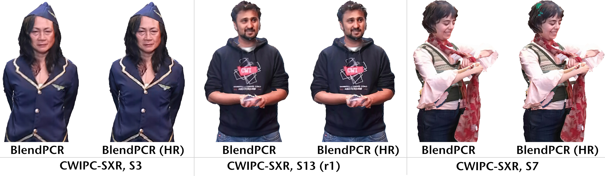

# BlendPCR: Seamless and Efficient Rendering of Dynamic Point Clouds (Real-Time)
### [Project Page](https://cgvr.cs.uni-bremen.de/projects/blendpcr) |  [Video](https://cgvr.cs.uni-bremen.de/projects/blendpcr/video.mp4) | [Paper](https://link_to_eg_digital_library)
 

C++/OpenGL implementation of our real-time renderer for dynamic point clouds from multiple RGB-D cameras, combining efficiency and quality while preventing the common z-fighting-like seam flickering effect.

*Note: This software project is a lite version of our internal Point Cloud Rendering Framework at CGVR. It is designed to load the CWIPC-SXR dataset using the Azure Kinect SDK and render it via our BlendPCR rendering method after installation.*

## Requirements
 - **CMake** ≥ 3.5
 - **OpenGL** ≥ 3.3
 - **Azure Kinect SDK** 1.41
 - **nlohmann/json**
 
## Installation
TODO

## Run
TODO

## Cite
TODO
