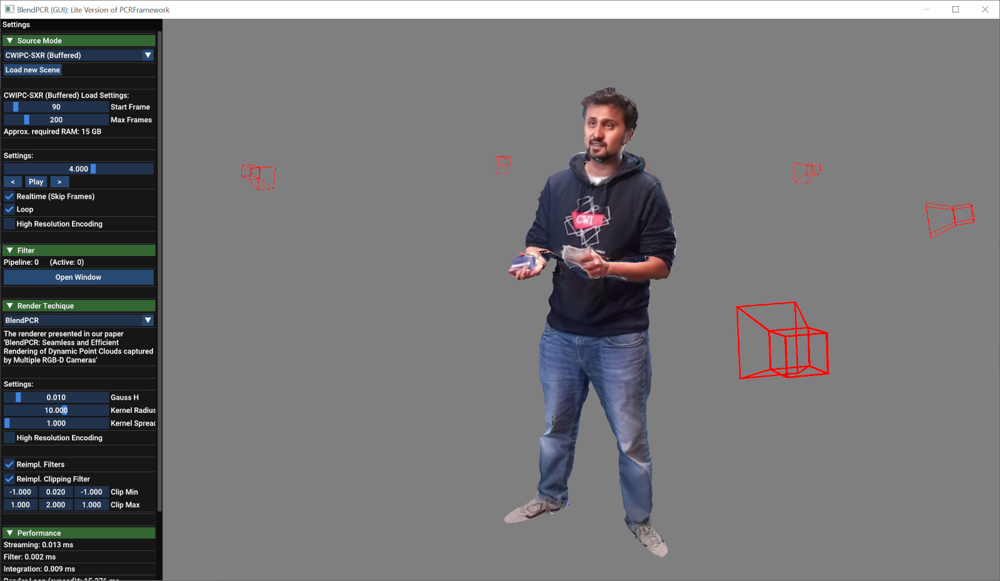

# BlendPCR: Seamless and Efficient Rendering of Dynamic Point Clouds captured by Multiple RGB-D Cameras
#### [Project Page](https://cgvr.cs.uni-bremen.de/projects/blendpcr) |  [Video](https://cgvr.cs.uni-bremen.de/projects/blendpcr/video.mp4) | Paper (available soon)

C++/OpenGL implementation of our real-time renderer BlendPCR for dynamic point clouds derived from multiple RGB-D cameras. It combines efficiency with high-quality rendering while effectively preventing common z-fighting-like seam flickering. The software is equipped to load and stream the CWIPC-SXR dataset for test purposes and comes with a GUI.

[Andre Mühlenbrock¹](https://orcid.org/0000-0002-7836-3341), [Rene Weller¹](https://orcid.org/0009-0002-2544-4153), [Gabriel Zachmann¹](https://orcid.org/0000-0001-8155-1127)\
¹Computer Graphics and Virtual Reality Research Lab ([CGVR](https://cgvr.cs.uni-bremen.de/)), University of Bremen

*Conditionally Accepted at ICAT-EGVE 2024*
 

## Pre-built Binaries
If you only want to test the software, including the BlendPCR renderer, without editing the implementation, we also offer pre-built binaries:
- [Download Windows (64-Bit)](), without CUDA for all graphic cards.

## Build Requirements

Note that we also provide pre-built binaries for Windows, and you do not need to build from source code just to test: 

### Required:
 - **CMake** ≥ 3.11
 - **OpenGL** ≥ 3.3
 - **C++ Compiler**, e.g. MSVC v143
 - **Azure Kinect SDK 1.4.1**: Required to load and stream the CWIPC-SXR dataset.

*Note: As the C++ compiler, we have currently only tested MSVC, but other compilers that support the Azure Kinect SDK 1.4.1 are likely to work as well.*

### Optional:
 - **CUDA Toolkit 12.1:** CUDA Kernels are currently only used for a *SpatialHoleFiller*, *ErosionFilter* and *ClippingFilter*. We have reimplemented these filters as GLSL passes in case of *BlendPCR*, so even without CUDA almost the same visual quality is achieved as presented in the paper.
 

*Additionally, this project uses small open-source libraries that we have directly integrated into our source code, so no installation is required. You can find them in the `lib` folder. 
A big thank you to the developers of
[Dear ImGui 1.88](https://github.com/ocornut/imgui),
[nlohmann/json](https://github.com/nlohmann/json),
[GLFW 3.3](https://www.glfw.org/),
[stb_image.h](https://github.com/nothings/stb),
[tinyobjloader](https://github.com/tinyobjloader/tinyobjloader),
[imfilebrowser](https://github.com/AirGuanZ/imgui-filebrowser), and
[GLAD](https://gen.glad.sh/).*
## Build from Source
### Azure Kinect SDK 1.4.1
This project has been tested with Azure Kinect SDKs version 1.4.1, although other SDK versions may also be compatible. 

On Windows, you can install `Azure Kinect SDK 1.4.1.exe` from the official website using the default paths. Once installed, the program should be buildable and executable, since the *CMakeLists.txt* is configured to search at default paths.

If you use custom paths or are operating on Linux, please set the following CMAKE-variables:
 - `K4A_INCLUDE_DIR` to the directory containing the `k4a` and `k4arecord` folders with the include files. 
 - `K4A_LIB` to the file path of `k4a.lib` 
 - `K4A_RECORD_LIB` to the file path of `k4arecord.lib`

**Note:** Current usage of the *k4a* and *k4arecord* libraries included with **vcpkg** might lead to errors, as both libraries seem to be configured to create an spdlog instance with the same name.

### BlendPCR

 1) After installing Azure Kinect SDK 1.4.1, simply clone the BlendPCR repository and run CMake. 
 2) If you don't use Windows or installed the Azure Kinect SDK to a custom path, configure the variables above. 
 3) Build & Run.

## Run

### CWIPC-SXR Dataset
To use the renderer out-of-the-box, RGB-D recordings from seven Azure Kinect sensors are required, and these recordings must conform to the format of the CWIPC-SXR dataset.

You can download the CWIPC-SXR dataset here: **[CWIPC-SXR Dataset](https://www.dis.cwi.nl/cwipc-sxr-dataset/downloads/)**. 

It is recommended to download only the `dataset_hierarchy.tgz`, which provides metadata for all scenes, as the entire dataset is very large (1.6TB). To download a specific scene, such as the *S3 Flight Attendant* scene, navigate to the `s3_flight_attendant/r1_t1/` directory and run the `download_raw.sh` file, which downloads the `.mkv` recordings from all seven cameras. After downloading, ensure that the `.mkv` recordings are located in the `raw_files` folder. The scene is now ready to be opened in this software project.

### Source Mode
When loading the CWIPC-SXR dataset, you have two options:

- **CWIPC-SXR (Streamed):** This mode streams the RGB-D camera recordings directly from the hard drive. Operations such as reading from the hard drive, color conversion (MJPEG to BGRA32), and point cloud generation are performed on the fly. Real-time streaming is usually not feasible when using seven cameras.
- **CWIPC-SXR (Buffered):** This mode initially reads the complete RGB-D recordings, performs color conversion, and generates point clouds. While this process can be time-consuming and requires significant RAM, it enables subsequent real-time streaming of the recordings.

After choosing your preferred mode, a file dialog will appear, prompting you to select the `cameraconfig.json` file for the scene you wish to load. Playback will commence a few seconds or minutes after the selection, depending on the chosen Source Mode.

## Remarks
### Point Cloud Filters via CUDA
In our research paper, we conducted visual comparisons among the SplatRenderer, Simple Mesh Renderer, TSDF, and BlendPCR. Each renderer utilized the same set of CUDA-implemented filters: *ErosionFilter*, *SpatialHoleFilter*, and *ClippingFilter*, located in the `src/pcfilter/` folder. These filters are enabled by default when the project is compiled with CUDA support (I.e. if `USE_CUDA` is set to `ON` in the CMAKE configuration).

For scenarios where CUDA is not used, we have implemented *SpatialHoleFiller* and *ErosionFilter* as an initial GLSL pass in the `BlendPCR`, which is automatically activated when CUDA is disabled during the build process. This way, we are able to achieve the same visual quality even without CUDA. It is important to note that without CUDA, both the SplatRenderer and Simple Mesh Renderer may exhibit lower visual quality than that demonstrated in our paper, even if the BlendPCR renderer is as presented in the paper.

## Cite
Will be added as soon the paper is published.
