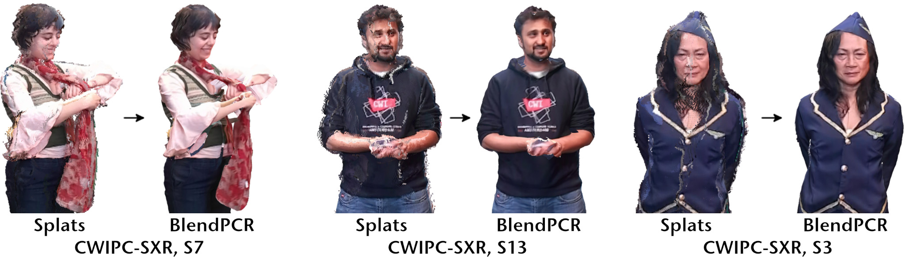

# BlendPCR: Seamless and Efficient Rendering of Dynamic Point Clouds captured by Multiple RGB-D Cameras
### [Project Page](https://cgvr.cs.uni-bremen.de/projects/blendpcr) |  [Video](https://cgvr.cs.uni-bremen.de/projects/blendpcr/video.mp4) | [Paper](https://link_to_eg_digital_library)
 

C++/OpenGL implementation of our real-time renderer for dynamic point clouds from multiple RGB-D cameras, combining efficiency and quality while preventing the common z-fighting-like seam flickering effect.

*After installation, this software is able to load and stream the CWIPC-SXR dataset and render it using our BlendPCR renderer.*

## Requirements
 - **CMake** ≥ 3.5
 - **OpenGL** ≥ 3.3
 - **Azure Kinect SDK** 1.41
 - **nlohmann/json**
 
## Installation
TODO

## Run

### Source Mode
When loading the CWIPC-SXR dataset, you have two options:

- **CWIPC-SXR (Streamed):** This mode streams the RGB-D camera recordings directly from the hard drive. Operations such as reading from the hard drive, color conversion (MJPEG to BGRA32), and point cloud generation are performed on the fly. Real-time streaming is usually not feasible when using seven cameras.
- **CWIPC-SXR (Buffered):** This mode initially reads the complete RGB-D recordings, performs color conversion, and generates point clouds. While this process can be time-consuming and requires significant RAM, it enables subsequent real-time streaming of the recordings.

After choosing your preferred mode, a file dialog will appear, prompting you to select the `cameraconfig.json` file for the scene you wish to load. Playback will commence a few seconds or minutes after the selection, depending on the chosen Source Mode.

## Cite
Will be added as soon the paper is published.
